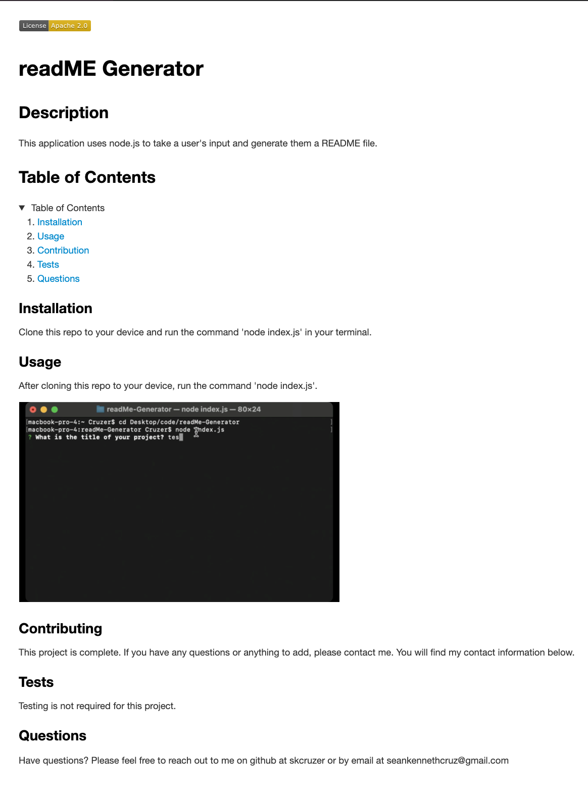
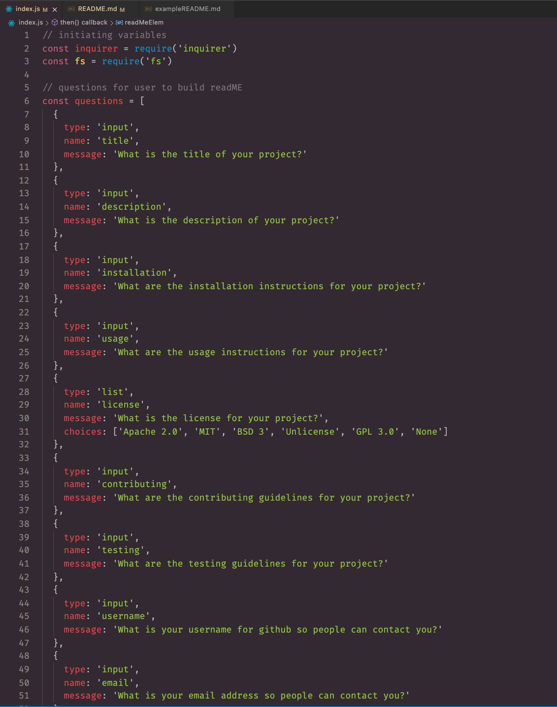
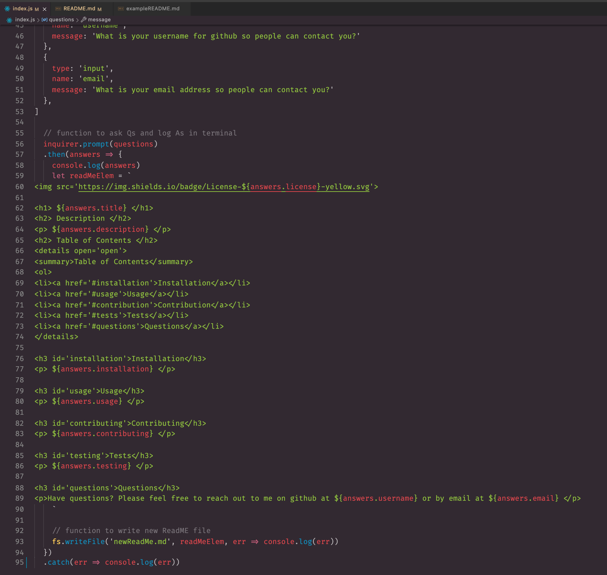
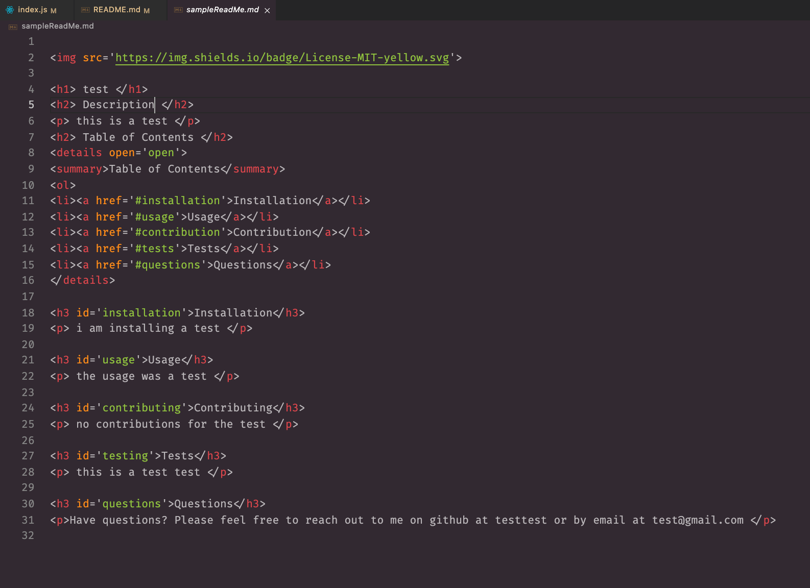

<h1> readME Generator </h1>
<h2> Description </h2>

 This application uses <code>node.js</code> to take a user's input and generate them a README file. 

<h2> Table of Contents </h2>

Table of Contents

<ol>
<li><a href='#installation'>Installation</a></li>
<li><a href='#usage'>Usage</a></li>
<li><a href='#contribution'>Contribution</a></li>
<li><a href='#tests'>Tests</a></li>
<li><a href='#questions'>Questions</a></li>

## <h3 id='installation'>Installation</h3>

 Clone this repo to your device and run the command <code>node index.js</code> in your terminal. 

## <h3 id='usage'>Usage</h3>

 After cloning this repo to your device, run the command <code>node index.js</code>. 

Youtube Link: <a href='https://youtu.be/gcb6_WqP-iI'target='_blank'>README Generator Walkthrough</a>

## <h3 id='contributing'>Contributing</h3>

 This project is complete. If you have any questions or anything to add, please contact me. You will find my contact information below. 

## <h3 id='testing'>Tests</h3>

 Testing is not required for this project.  

## <h3 id='questions'>Questions</h3>

Have questions? Please feel free to reach out to me on github at <a href='https://github.com/skcruzer'target='_blank'>skcruzer </a> or by email at <a href='mailto:seankennethcruz@gmail.com'target='_blank'>seankennethcruz@gmail.com</a>.

- - -
© 2022 Skcruzer, Inc. All Rights Reserved.